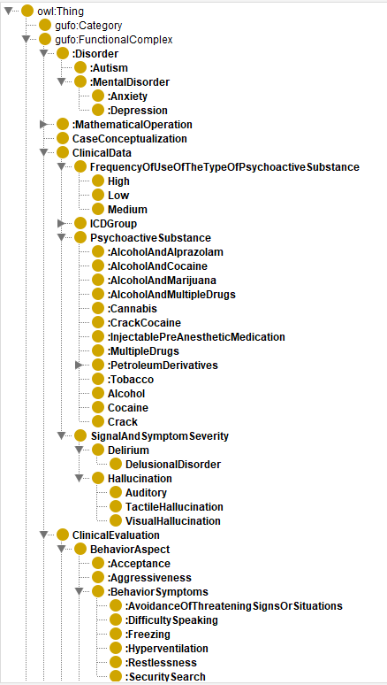
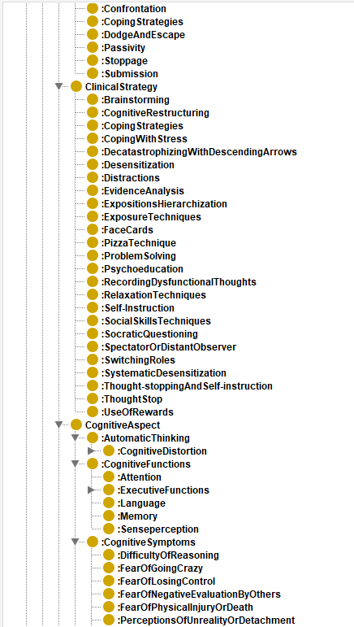
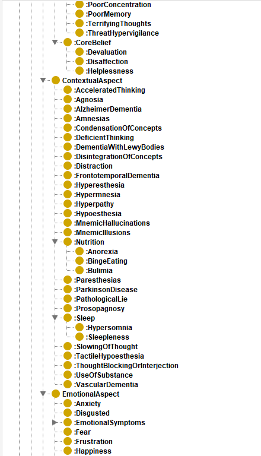
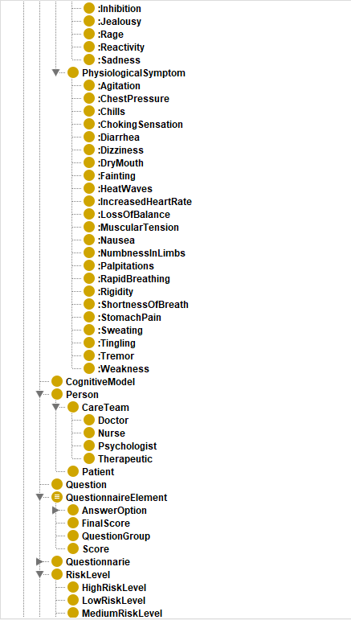
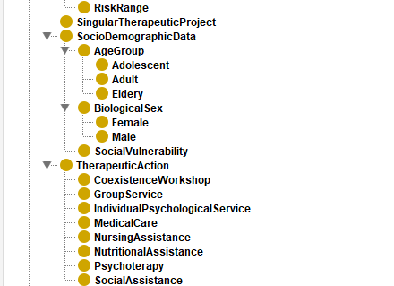

# tcc-ontologia-ontriscal

> Documentação visual e técnica da **ONTRISCAL** aplicada ao domínio da **Terapia Cognitivo-Comportamental (TCC)**, no contexto do Trabalho de Conclusão de Curso em Engenharia de Software.


---

## 📑 Sumário

- [Sobre o projeto](#sobre-o-projeto)
- [Repositório relacionado](#repositório-relacionado)
- [A ontologia ONTRISCAL](#a-ontologia-ontriscal)
  - [Domínios de cobertura](#domínios-de-cobertura)
  - [Referência original](#referência-original)
- [Relação com o TCC](#relação-com-o-tcc)
- [Estrutura do repositório](#estrutura-do-repositório)
- [Arquivo `.owl`](#arquivo-owl)
- [Classes da ONTRISCAL](#classes-da-ontriscal)
- [Referências](#referências)
- [Autoria](#autoria)

---

## 📖 Sobre o projeto

Este repositório serve como **documento complementar** ao seguinte Trabalho de Conclusão de Curso:

| Campo | Descrição |
| :--- | :--- |
| **Título** | Automação da geração de SDD e utilização em IA para TCC, integrando Ontologia e Grafos de Conhecimento |
| **Curso** | Engenharia de Software |
| **Instituição** | Associação Propagadora Esdeva — Centro Universitário Academia (UniAcademia) |
| **Ano** | 2026 |
| **Autor** | Renzo Faedda Panza |
| **Orientador** | Evaldo de Oliveira da Silva |

---

## 🔗 Repositório relacionado

- **Implementação (HOMOGENISE):** <https://github.com/evaldo/homogenise>

---

## 🧠 A ontologia ONTRISCAL

A **Ontologia da Estratificação de Riscos em Saúde Mental (ONTRISCAL)** foi desenvolvida por **Silva (2023)** para utilização na aplicação **HOMOGENISE**, tendo como fundamentação a ontologia de alto nível **Unified Foundational Ontology (UFO)**.

A ONTRISCAL foi construída em colaboração com **especialistas em psicologia clínica** do Centro Universitário UniAcademia (Juiz de Fora), focando na cobertura dos conceitos de **estratificação de risco e tratamento em transtornos de ansiedade**.

### Domínios de cobertura

- Sinais e sintomas clínicos;
- Estratificação de risco em ansiedade;
- Dados sociodemográficos do paciente;
- Técnicas e intervenções da TCC;
- Níveis de risco (separados em **Baixo**, **Médio** e **Alto**);
- Crenças centrais e pensamentos automáticos.

### Referência original

> DA SILVA, Evaldo de Oliveira. **Homogenise: método para modelagem ontológica do conhecimento em pesquisas quali-quanti**. 2023.

---

## 🔬 Relação com o TCC

Durante o desenvolvimento do presente trabalho, a ontologia ONTRISCAL foi adotada como **domínio base** em três frentes:

1. No **mapeamento das variáveis** dos dados de TCC a conceitos ontológicos utilizados nos documentos do *Semantic Data Dictionary* (SDD);
2. Na **fundamentação das triplas RDF/OWL** que compõem o Grafo de Conhecimento (GC);
3. Nas **inferências realizadas via SPARQL** sobre os padrões clínicos da TCC.

---

## 📂 Estrutura do repositório

```text
tcc-ontologia-ontriscal/
├── README.md
├── ontologia-ontriscal/
│   └── ontriscal_gufo_owl.owl
└── imagens-ontriscal/
    ├── classe-ontriscal-1.png
    ├── classe-ontriscal-2.png
    ├── classe-ontriscal-3.png
    ├── classe-ontriscal-4.png
    └── classe-ontriscal-5.png
```

---

## 📦 Arquivo `.owl`

O arquivo [`ontriscal_gufo_owl.owl`](./ontologia-ontriscal/ontriscal_gufo_owl.owl) é a **serialização formal** da ONTRISCAL, contendo a totalidade das classes, hierarquias e propriedades de objeto que materializam o domínio modelado.

### Especificações técnicas

| Característica | Valor |
| :--- | :--- |
| **Formato de serialização** | OWL/XML |
| **IRI base** | `http://ontriscal` |
| **Fundamentação ontológica** | gUFO — *gentle Unified Foundational Ontology* (`http://purl.org/nemo/gufo#`) |
| **Classes únicas declaradas** | 324 |
| **Relações de subclasse (`SubClassOf`)** | 326 |
| **Propriedades de objeto (`ObjectProperty`)** | 112 |
| **Editor utilizado** | Protégé[^1] |

### Prefixos declarados

```xml
xmlns      = "http://www.w3.org/2002/07/owl#"
xml:base   = "http://ontriscal"
rdf        = "http://www.w3.org/1999/02/22-rdf-syntax-ns#"
rdfs       = "http://www.w3.org/2000/01/rdf-schema#"
xsd        = "http://www.w3.org/2001/XMLSchema#"
gufo       = "http://purl.org/nemo/gufo#"
```

### Como abrir o arquivo

1. Faça o *download* do **Protégé** em <https://protege.stanford.edu/>;
2. Em **File → Open**, selecione o arquivo `ontriscal_gufo_owl.owl`;
3. A hierarquia de classes pode ser navegada pela aba **Classes** (ou **Entities → Class hierarchy**);
4. As propriedades de objeto que relacionam as classes ficam disponíveis na aba **Object Properties**.

> 💡 As classes da ONTRISCAL são organizadas como subclasses dos conceitos fundacionais do gUFO — em especial, `gufo:FunctionalComplex` (para entidades concretas do domínio clínico) e `gufo:Category` (para tipos abstratos).

---

## 🗂️ Classes da ONTRISCAL

A ONTRISCAL possui classes criadas para representar **conceitos e propriedades** relevantes ao seu domínio, utilizadas para a anotação de **dados clínicos, sociodemográficos e níveis de cuidado** *(Silva, 2023)*.

A hierarquia completa é apresentada nas figuras a seguir, exportadas diretamente do Protégé.

### Imagem 1 — Transtornos, dados clínicos e início da avaliação clínica



---

### Imagem 2 — Estratégias clínicas e aspectos cognitivos



---

### Imagem 3 — Crenças centrais, aspectos contextuais e emocionais



---

### Imagem 4 — Sintomas fisiológicos, pessoas, questionários e níveis de risco



---

### Imagem 5 — Faixas de risco, dados sociodemográficos e ações terapêuticas



---

> 💡 Todas as imagens são de **autoria própria** e foram produzidas utilizando o **Protégé**[^1].

---

## 📚 Referências

- DA SILVA, Evaldo de Oliveira. **Homogenise: método para modelagem ontológica do conhecimento em pesquisas quali-quanti**. 2023.
- GUIZZARDI, Giancarlo et al. **gUFO: A Lightweight Implementation of the Unified Foundational Ontology (UFO)**. NEMO — Núcleo de Estudos em Modelagem Conceitual e Ontologias / UFES. Disponível em: <https://nemo-ufes.github.io/gufo/>.

[^1]: Protégé — *ontology editor* mantido pela Universidade de Stanford. Disponível em: <https://protege.stanford.edu/>.

---

## ✍️ Autoria

**Renzo Faedda Panza**
Graduando em Engenharia de Software — UniAcademia
Orientador: Prof. Evaldo de Oliveira da Silva

> Este repositório é parte integrante do TCC e tem finalidade exclusivamente acadêmica.